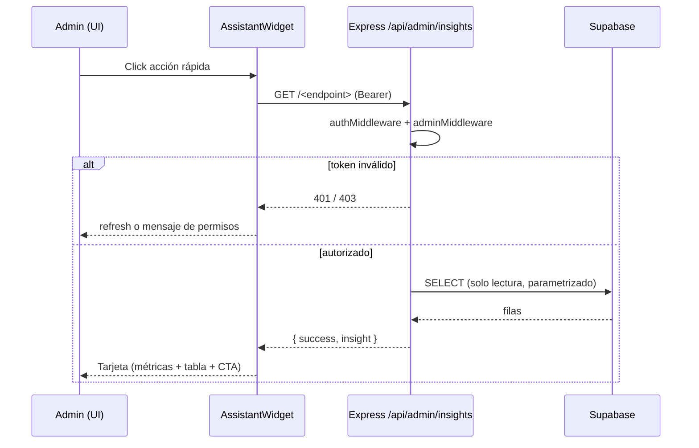

# Flujo: Asistente del panel admin (consultas rápidas)

## Objetivo
Permitir que la administradora obtenga métricas operativas y de negocio en segundos
desde un único punto, sin navegar entre pantallas.

## Actores
- **Admin** (rol `admin` en `public.profiles`).
- **Frontend** (`AssistantWidget` en el layout admin).
- **Backend** (`/api/admin/insights/*`, Express).
- **PostgreSQL/Supabase** (tablas `productos`, `ventas`).

## Pre-condiciones
- Admin autenticado: sesión de Supabase válida (el token va como `Bearer` vía `apiFetch`).
- Backend levantado con acceso a la base.

## Pasos principales (happy path)
1. El admin abre el widget flotante (FAB) presente en cualquier ruta `/admin/*`.
2. Elige una acción rápida (ej. "Stock bajo").
3. El front pega `GET /api/admin/insights/<endpoint>` con el Bearer del admin.
4. `authMiddleware` verifica el token contra Supabase y `adminMiddleware` valida el rol.
5. El controller consulta `models/Insights.js` (solo lectura) y arma el envelope
   `{ success, insight }` con `metrics`, `table` y `actions`.
6. El front renderiza una tarjeta: métricas, filas, indicador de criticidad y CTA.
7. La consulta se agrega a "Recientes"; el admin puede marcarla como favorita.

## Caminos alternativos
- Si el admin marca/desmarca **favorito**, se reordena la grilla y se persiste en `localStorage`.
- Si toca una **acción sugerida** (ej. "Generar reposición"), navega a la pantalla
  correspondiente (`/admin/products`, `/admin/sales`) y se cierra el panel.
- En `pending-pickups`, cada fila ofrece **contactar al cliente** por email (`mailto:`),
  porque hoy `ventas` no guarda el teléfono del comprador.

## Errores esperados
- **401** (token ausente/vencido) → `apiFetch` intenta refresh una vez; si falla,
  desloguea y NO se muestran datos.
- **403** (autenticado sin rol admin) → tarjeta con "Tu sesión no tiene permisos…".
- **500 / red caída** → estado de error con mensaje humano + botón "Reintentar".
- **Sin filas** → empty state por consulta (no tabla vacía ni error).

## Regla de negocio — "Retiros por WhatsApp sin confirmar" (pending-pickups)
Un pedido entra en `pending-pickups` cuando cumple **todo**:
- `payment_status = 'pendiente'`,
- `shipping_method = 'local'` (valor real del checkout; ver `utils/labels.ts`),
- `payment_method = 'transfer'` → **proxy de canal WhatsApp**: el checkout por
  transferencia abre `wa.me` con el pedido prearmado, así que toda transferencia
  pasó por WhatsApp.

Aparece **desde el momento en que se genera el pedido** (el checkout por transferencia
inserta la venta `pendiente` y luego abre WhatsApp; no se espera ningún umbral de minutos).
Se mantiene visible hasta que el admin lo confirma/cancela **o** el sweep del backend lo
expira a las **5 h** (y devuelve el stock). Si el cliente solo toca el botón flotante de
WhatsApp sin pasar por el checkout, no se crea ninguna venta y no aparece.

> Mejora futura: columna explícita `origin` (`'whatsapp' | 'web' | 'mp'`) en `ventas`
> para no depender del método de pago como proxy de canal.

## Diagrama

## Datos involucrados
- **Entrada:** id de la acción rápida (+ `threshold` opcional en low-stock).
- **Salida:** envelope `insight` (no persiste nada).
- **Persistencia local (cliente):** favoritos e historial en `localStorage`
  (`assistant:favorites`, `assistant:history`).
