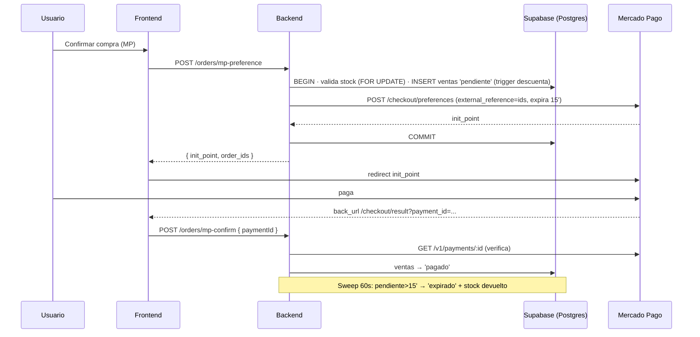

# Flujo: Checkout y ciclo de vida de una orden

## Objetivo
Comprar productos pagando con Mercado Pago o por transferencia, manteniendo el
stock y el estado de pago consistentes entre frontend, backend y Supabase.

## Actores
- Usuario (logueado vía Supabase Auth)
- Frontend React (checkout / checkout result / mis compras)
- Backend Express (`/api/orders`, `/api/shipping`)
- Mercado Pago (checkout externo + API de pagos)
- Admin (panel Ventas: transferencias)

## Pre-condiciones
- Usuario autenticado (el checkout lo exige; el token Bearer viaja vía `apiFetch`).
- Producto activo con stock suficiente.
- Para MP: `MP_ACCESS_TOKEN` configurado en el backend (si falta → 503 con mensaje claro).

## Modelo de stock (importante)
El descuento de stock lo hace el **trigger `trg_decrement_stock`** (AFTER INSERT en
`ventas`), que existe en la base de datos. El backend NO descuenta al crear órdenes:
- **Crear orden (INSERT en `ventas`)** → el trigger descuenta stock.
- **Antes de insertar**, el backend valida disponibilidad con la fila del producto
  bloqueada (`SELECT stock … FOR UPDATE`); si no alcanza, 409 y rollback (evita
  la sobreventa que el trigger permitiría con su `GREATEST(stock,0)`).
- **Cancelar / expirar** → el backend restaura el stock.
- **Pago acreditado después de expirar** → el backend vuelve a descontar.

## Pasos principales (happy path — Mercado Pago)
1. Usuario confirma el pedido en `/checkout` y acepta el aviso de 15 minutos.
2. Front llama `POST /api/orders/mp-preference` con items, comprador y envío.
3. Backend (transacción): valida payload → valida stock disponible con
   `SELECT … FOR UPDATE` → inserta filas en `ventas` con `payment_status='pendiente'`
   (el trigger descuenta stock) → crea la preferencia en MP (`external_reference`
   = ids de las ventas, expiración 15 min) → commit.
4. Front guarda `mp_order_ids` en sessionStorage y redirige a `init_point`.
5. Usuario paga en Mercado Pago y vuelve a `/checkout/result?collection_status=approved&payment_id=...`.
6. Front llama `POST /api/orders/mp-confirm { paymentId }`; el backend verifica el
   pago contra la API de MP y marca las ventas como `'pagado'`. Limpia el carrito.
7. La compra aparece en "Mis compras" (`GET /api/orders/user?email=` — solo dueño o admin).

## Caminos alternativos
- **Transferencia:** el front llama `POST /api/orders/transfer` al backend Express
  (con Bearer token Supabase del usuario logueado). El backend valida stock con
  `SELECT … FOR UPDATE`, inserta en `ventas` (el trigger descuenta stock) y devuelve
  `order_ids`. El front abre WhatsApp con el resumen. El admin luego la resuelve en el panel Ventas:
  - Confirmar → `PATCH /api/orders/:id/confirm-transfer` → `'pagado'` (el stock ya
    se descontó al insertar; no se vuelve a tocar).
  - Cancelar → `PATCH /api/orders/:id/cancel-transfer` → `'cancelado'` + stock restaurado.
- **Nudge post-WhatsApp (transferencia):** cuando el usuario vuelve a la pestaña tras
  abrir WhatsApp (evento `visibilitychange`), el front muestra "¿Pudiste completar tu
  compra?" y registra la respuesta vía `POST /api/orders/nudge { orderIds, response }`
  (auth, solo dueño o admin), que escribe `ventas.origin`:
  - *Sí, ya envié el comprobante* → `origin='wa_confirmado'` (sigue `pendiente`).
  - *Todavía no* → `origin='wa_sin_confirmar'` (sigue `pendiente`, stock retenido).
  - *No, cancelar* → `origin='wa_abandonado'` + `'cancelado'` + stock restaurado.
  Es best-effort: si falla, el sweep de 5 h expira la orden igual. Idempotente (solo
  actúa sobre órdenes `transfer` que sigan `pendiente`).
- **Usuario vuelve sin pagar (failure):** CheckoutResult llama
  `POST /api/orders/:id/cancel` por cada orden → `'cancelado'` + stock restaurado
  (idempotente si el sweep ya la expiró).
- **Webhook:** si `MP_WEBHOOK_URL` está configurada (o se configura en el panel de MP),
  MP notifica `POST /api/orders/mp-webhook` y el backend marca `'pagado'` sin
  depender del navegador del usuario.

## Errores esperados
- Stock insuficiente al crear preferencia → 409 con nombre del producto; nada se persiste.
- MP caído / token inválido → 502 "No se pudo conectar con Mercado Pago…"; rollback completo.
- `MP_ACCESS_TOKEN` ausente → 503 "Los pagos con Mercado Pago no están disponibles…".
- Consulta/cancelación de órdenes ajenas → 403.
- Orden ya pagada al intentar cancelar → 409.

## Expiración (sweep cada 60 s en el backend)
- MP `pendiente` > 15 min → `'expirado'` + stock restaurado.
- Transferencia `pendiente` > 5 h → `'expirado'` (nunca reservó stock).
- Pago acreditado después de expirar: `mp-confirm`/webhook pasa `'expirado'` →
  `'pagado'` y vuelve a descontar el stock devuelto.

## Diagrama

## Datos involucrados
- **Entrada:** items (productId, cantidad, precios, variantes), comprador, envío.
- **Persistencia:** `public.ventas` (una fila por producto; el costo de envío se
  suma a la primera línea), `public.productos.stock`.
- **Estados de `payment_status`:** `pendiente → pagado | cancelado | expirado | fallido`.
- **`ventas.origin`** (respuesta del nudge post-WhatsApp): `null` (sin responder / MP) ·
  `wa_confirmado` · `wa_sin_confirmar` · `wa_abandonado`.
