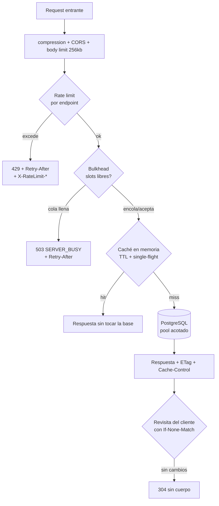
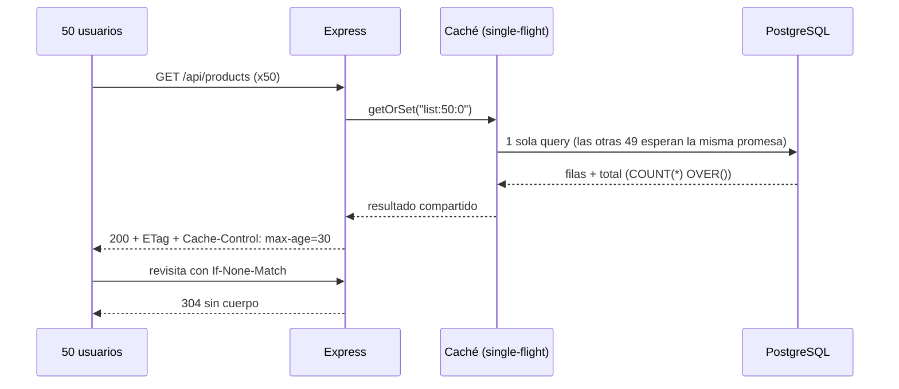
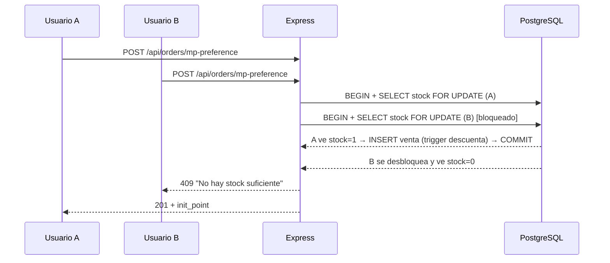
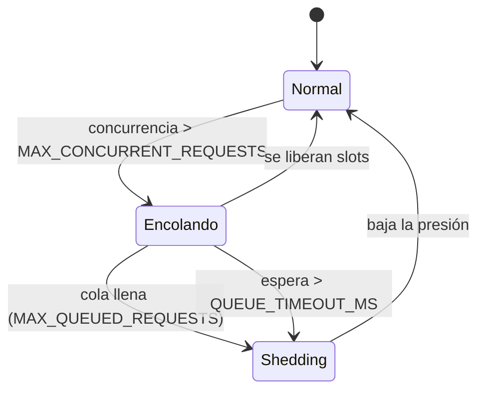

# Flujo: concurrencia y carga en el backend

## Objetivo
Que muchos usuarios simultáneos se atiendan de forma eficiente, sin bloquear el
event loop, sin agotar el pool de PostgreSQL y sin que un pico degrade a todos:
ante saturación se degrada de forma **predecible** (503 con `Retry-After`) en
lugar de colapsar.

## Actores
- Usuario del sitio (catálogo, checkout) y administradora (panel, asistente).
- Backend Express (instancia única en Railway).
- PostgreSQL / Supabase (pooler en **modo sesión**, techo de **15 clientes**).
- Servicios externos: Mercado Pago, Supabase Auth, Cloudinary.

## Pre-condiciones
- Backend detrás de un proxy que setea `X-Forwarded-For` (`trust proxy` activo).
- Variables de la §8.1 de `DOCUMENTACION_BACKEND.md` (todas con default).

---

## Capas de defensa (en orden de ejecución)

| Capa | Qué resuelve | Dónde vive |
|---|---|---|
| Caché HTTP (`Cache-Control` + `ETag` + 304) | Evita que la lectura llegue siquiera al backend | `middleware/httpCache.js` |
| Compresión gzip | Menos bytes y menos tiempo de socket por respuesta | `server.js` |
| Rate limit por endpoint | Abuso, fuerza bruta y scraping | `middleware/rateLimit.js` |
| Bulkhead + cola | Que la concurrencia no supere lo que la base aguanta | `middleware/concurrencyLimit.js` |
| Caché en memoria + single-flight | Que N lecturas iguales sean 1 sola query | `utils/cache.js` |
| Pool acotado + timeouts | Que una query colgada no se lleve puesto al resto | `config/database.js` |
| Paginación | Que ninguna respuesta crezca sin techo | product/order controllers |
| Transacciones cortas + `FOR UPDATE` | Consistencia de stock sin sobreventa | `controllers/orderController.js` |
| Apagado ordenado | No cortar requests en vuelo en cada deploy | `server.js` |

---

## Camino 1 — Lectura concurrente del catálogo (happy path)

50 usuarios abren el catálogo al mismo tiempo con la caché fría:

Medido en local (`node qa/load-test.js`): **p90 ≈ 30 ms con 50 usuarios
simultáneos, 0 % de error**, con la caché absorbiendo la mayoría de las lecturas.

## Camino 2 — Compra concurrente del último ítem

Dos usuarios compran la última unidad al mismo tiempo:

La llamada HTTP a Mercado Pago ocurre **después** del COMMIT: si se hiciera
dentro de la transacción, cada checkout retendría una conexión del pool durante
todo el round trip externo. Si Mercado Pago falla, se compensa cancelando las
reservas y devolviendo el stock (`releaseOrders`), y el sweep de órdenes vencidas
queda como red de seguridad.

## Camino 3 — Doble submit (doble click en "Pagar")

La segunda request con el mismo usuario y el mismo carrito, mientras la primera
sigue en vuelo, **comparte la misma ejecución** (single-flight por hash del
payload) en vez de crear un segundo juego de ventas y descontar stock dos veces.

## Camino 4 — Saturación

Verificado con 800 requests concurrentes **todas cache-miss**: 224 respondidas
con 200, 576 con **503 + `Retry-After`**, **0 errores 500**, pool sin exceder su
máximo y cola drenada a 0 al terminar.

---

## Errores esperados

| Situación | Respuesta | Cabeceras |
|---|---|---|
| Excede el rate limit del endpoint | `429` `{ code: 'RATE_LIMITED' }` | `Retry-After`, `X-RateLimit-Limit/Remaining/Reset` |
| Cola de concurrencia llena o espera agotada | `503` `{ code: 'SERVER_BUSY' }` | `Retry-After: 2` |
| Body mayor a 256 kb | `413` `{ code: 'PAYLOAD_TOO_LARGE' }` | — |
| JSON malformado | `400` `{ code: 'INVALID_JSON' }` | — |
| Falla de base o infraestructura | `500` `{ code: 'INTERNAL_ERROR' }` genérico | El detalle va al log, nunca al cliente |
| Stock insuficiente al reservar | `409` con el nombre del producto | — |

## Datos involucrados
- **Entrada:** requests HTTP; sin persistencia propia de estas capas.
- **Estado en memoria (por proceso):** contadores de rate limit, cola del
  bulkhead y cachés con TTL. Nada de esto es fuente de verdad: reiniciar el
  proceso sólo pierde caché y contadores.
- **Persistencia:** sin cambios de esquema. Sí se agregan **índices** de soporte
  en `db/migrations/2026-08-08_add_performance_indexes.sql`.

## Límites conocidos
- Todo el estado es **por proceso**. Si el backend escala a más de una instancia:
  los límites de rate se multiplican por instancia y cada una tendrá su propia
  caché (divergencia acotada por los TTL, que son cortos). El paso siguiente sería
  mover ambos a Redis; el store del rate limit ya está preparado para inyectarse.
- `CACHE_TTL_AUTH_SECONDS` define cuánto puede sobrevivir un token ya revocado.
- El techo duro de la base es el pooler de Supabase (**15 clientes**), no el
  backend: subir `DB_POOL_MAX` sin ampliarlo allá reintroduce `EMAXCONNSESSION`.
