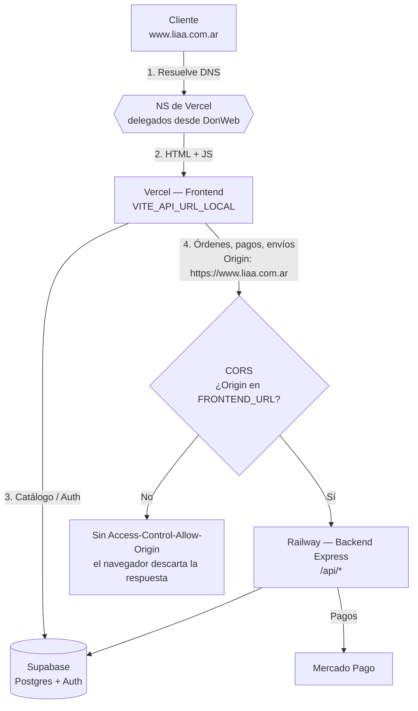

# Flujo: Despliegue a producción (dominio, hosting y CORS)

## Objetivo
Dejar la tienda accesible en `liaa.com.ar` con el frontend en Vercel, el backend en Railway
y el CORS habilitado, sin cambios de código: todo se resuelve con configuración en paneles.

## Actores
- **DonWeb** — revendedor donde se compró el dominio. Es el **único panel** que se toca para
  administrarlo (incluida la delegación de nameservers). No se entra a nic.ar.
- **NIC Argentina** — autoridad de `.com.ar`. Aprueba el registro (24–48 h) y publica la delegación.
- **Vercel** — hosting del frontend (Vite + React) y proveedor de DNS del dominio.
- **Railway** — hosting del backend Express (`lia-store-production.up.railway.app`).
- **Supabase** — Postgres + Auth. El front le pega directo para catálogo, auth y contenido.
- **Navegador del cliente** — quien aplica la política de CORS.

## Pre-condiciones
- Dominio registrado y en estado **DOMINIO ACTIVO** en DonWeb (los pasos de DNS no sirven antes).
- Proyecto del front desplegado en Vercel y backend desplegado en Railway.

## Cadena de dependencias
Cada eslabón necesita el anterior. Saltear el orden es la causa más común de fallas:

```
Registro del dominio → Zona DNS en Vercel → Delegación en DonWeb → Env vars (Vercel + Railway)
```

## Pasos principales (happy path)
1. **DonWeb** — el dominio termina el trámite en NIC.ar y pasa a *DOMINIO ACTIVO*.
2. **Vercel → Settings → Domains** — agregar `liaa.com.ar` **y** `www.liaa.com.ar`.
   Son dos registros distintos: el `www` no viene incluido con el apex. Esto crea la zona DNS
   y dispara la emisión automática del certificado TLS (Let's Encrypt, sin costo).
3. **DonWeb → Mis Dominios → liaa.com.ar → DNS / Delegación** — reemplazar los nameservers de
   DonWeb por los que indique Vercel (`ns1.vercel-dns.com` / `ns2.vercel-dns.com`).
   La propagación tarda de minutos a horas.
4. **Vercel → Environment Variables** — verificar `VITE_API_URL_LOCAL` (ver tabla abajo) y
   **redeployar**: Vite compila las variables dentro del bundle, guardar no alcanza.
5. **Railway → Variables** — agregar los dos orígenes nuevos a `FRONTEND_URL`. Railway
   redeploya solo al guardar.
6. Verificar: ambos dominios resuelven, el sitio carga por HTTPS y el checkout completa un pago.

## Caminos alternativos
- **Paso 2 antes del 3, siempre.** Si se delega a Vercel antes de crear la zona, los
  nameservers reciben consultas de un dominio que no conocen y responden error (SERVFAIL).
- **DNS fuera de Vercel** (ej. Cloudflare): válido. Se cargan los NS de ese proveedor en DonWeb
  y ahí se crean el `A`/`CNAME` del apex y del `www` apuntando a Vercel.
- **Redirección `www` → apex** (o al revés): no exime de agregar **ambos** a `FRONTEND_URL`.
  El navegador manda el `Origin` del dominio donde arrancó la request, antes de la redirección.

## Errores esperados

| Síntoma | Causa | Dónde se arregla |
|---|---|---|
| DNS responde **SERVFAIL** | El dominio existe y está delegado, pero los nameservers no tienen la zona cargada (o el registro sigue en trámite). | Vercel (crear zona) / esperar a NIC.ar |
| DNS responde **NXDOMAIN** | El dominio no existe: no se registró o venció. | DonWeb |
| El apex anda y `www` da error | Falta el registro del subdominio; no se hereda del apex. | Vercel → Domains |
| El navegador bloquea las requests y la consola dice *"No 'Access-Control-Allow-Origin' header"* | El origen no está en `FRONTEND_URL`. El server responde 200 pero sin el header: el bloqueo es del lado del cliente y no deja rastro en los logs del backend. | Railway → Variables |
| Preflight `OPTIONS` devolvía **500** | Regresión histórica: el callback de CORS emitía `new Error()` y el error subía al handler global de Express. Resuelto en `config/cors.js` usando `callback(null, false)`. | Ya corregido en código |
| El sitio carga pero no trae productos ni deja loguear | `VITE_API_URL_LOCAL` apunta a `localhost`: en producción resuelve a la máquina del visitante. | Vercel → Env vars + redeploy |

## Diagrama



## Datos involucrados — variables de entorno

| Variable | Dónde se carga | Valor en producción | Atención |
|---|---|---|---|
| `FRONTEND_URL` | Railway (backend) | CSV de orígenes: `http://localhost:5173,https://damiana-bella.vercel.app,https://lia-front-beta.vercel.app,https://liaa.com.ar,https://www.liaa.com.ar` | Sin espacios entre comas. Alimenta el CORS y los `back_urls` de Mercado Pago. Cada dominio del front va listado explícitamente. |
| `VITE_API_URL_LOCAL` | Vercel (frontend) | `https://lia-store-production.up.railway.app/api` | **Pese al sufijo `_LOCAL`, es la URL del backend en todos los entornos.** Debe terminar en `/api`. Requiere redeploy para tomar efecto. |
| `VITE_SUPABASE_URL` / `VITE_SUPABASE_ANON_KEY` | Vercel (frontend) | Proyecto Supabase | Claves públicas por diseño; la protección real es RLS en la base. |

En desarrollo (`NODE_ENV != production`) el backend acepta además cualquier `localhost` o
`127.0.0.1` en cualquier puerto, porque Vite cambia de puerto solo cuando el anterior está
ocupado. Ver `config/cors.js`.

## Cómo verificar

```bash
# 1. Resolución DNS de ambos dominios (deben devolver IPs de Vercel)
nslookup liaa.com.ar 8.8.8.8
nslookup www.liaa.com.ar 8.8.8.8

# 2. Preflight CORS real contra el backend.
#    Debe responder 204 e incluir el header Access-Control-Allow-Origin.
curl -i -X OPTIONS https://lia-store-production.up.railway.app/api/products \
  -H "Origin: https://www.liaa.com.ar" \
  -H "Access-Control-Request-Method: POST"
```

Un preflight sin el header `Access-Control-Allow-Origin` en la respuesta significa que el
origen **no** está habilitado, aunque el status sea 200.

## Riesgos operativos
- **Crédito de Railway.** El backend corre con saldo consumible. Si se agota, el servicio se
  apaga y caen productos, login, checkout y pagos. Es el único componente con vencimiento activo.
- **Plan de Vercel.** El plan Hobby cubre dominio propio y TLS, pero según los términos de Vercel
  es para uso personal/no comercial; una tienda que cobra encuadra en Pro. Alternativa sin esa
  restricción para el DNS: Cloudflare.
- **Propagación de DNS.** Los cambios de nameservers no son inmediatos. Un dominio que no
  resuelve dentro de las primeras horas no implica error de configuración.
